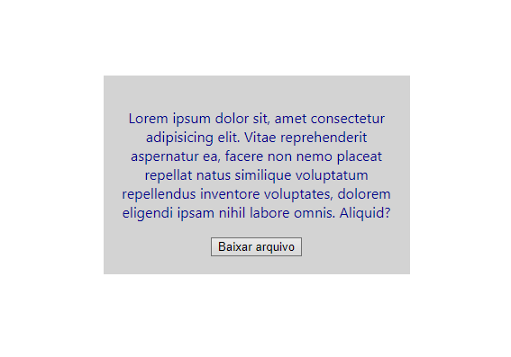
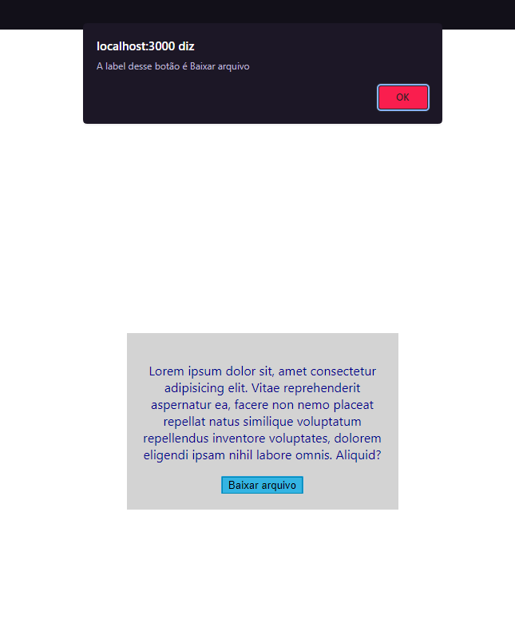

# Projeto react base 

Este projeto foi inicializado com create react app, para praticar a criação de componentes no react.

## Índice

- [Visão geral](#visão-geral)
  - [Desafio](#desafio)
  - [Como usar](#como-usar)
  - [Screenshot](#screenshot)
  - [Links](#links)
- [Meu processo](#meu-processo)
  - [Tecnologias utilizadas](#tecnologias-utilizadas)
- [Autor](#autor)
- [Agradecimentos](#agradecimentos)

## Visão geral

### Desafio

- Faça o componente renderizar na tela um parágrafo colorido e com todas as letras maiúsculas usando JS;
- Utilize props para passar o texto e a cor de texto desejada para dentro do componente (a cor pode ser uma palavra, como 'red', ou um hexadecimal);
- Pode utilizar o style inline para colorir o componente
- Crie um componente Button com um evento de clique que
apresente um alerta informando a prop label do botão quefoi clicado, com a seguinte mensagem: "A label desse botão é >insira a label aqui via JS<".

### Como usar

No diretório do projeto, você pode executar:

### `npm install`
Executa a instalação dos pacotes dependentes do projeto

### `npm start`

Executa o aplicativo no modo de desenvolvimento. 

Abra http://localhost:3000 para visualizá-lo no navegador.

A página será recarregada se você fizer edições. Você também verá erros de lint no console.

### `npm test`

Inicia o executor de teste no modo de observação interativo. Consulte a seção sobre como [executar testes](https://create-react-app.dev/docs/running-tests/) para obter mais informações.

### `npm run build`
Cria o aplicativo para produção na build pasta. Ele empacota corretamente o React no modo de produção e otimiza a compilação para obter o melhor desempenho.

A compilação é minificada e os nomes dos arquivos incluem os hashes. Se necessário, nomes de classe e nomes de função podem ser ativados para fins de criação de perfil. Consulte a seção de [compilação de produção](https://create-react-app.dev/docs/production-build/) para obter mais informações.

Seu aplicativo está pronto para ser implantado! Consulte a seção sobre [implantação](https://create-react-app.dev/docs/deployment/) para obter mais informações sobre como implantar seu aplicativo em provedores de hospedagem populares.

### `npm run eject`
Nota: esta é uma operação unidirecional. Uma vez que você eject, você não pode voltar atrás!

Se você não estiver satisfeito com a ferramenta de compilação e as opções de configuração, poderá fazê-lo ejecta qualquer momento. Este comando removerá a dependência de compilação única do seu projeto.

Em vez disso, ele copiará todos os arquivos de configuração e as dependências transitivas (webpack, Babel, ESLint, etc.) para o seu projeto como dependências em package.json. Tecnicamente, a distinção entre dependências e dependências de desenvolvimento é bastante arbitrária para aplicativos front-end que produzem pacotes estáticos.

Além disso, costumava causar problemas com algumas plataformas de hospedagem que não instalavam dependências de desenvolvimento (e, portanto, não conseguiam compilar o projeto no servidor ou testá-lo logo antes da implantação). Você é livre para reorganizar suas dependências package.json como achar melhor.

Todos os comandos, exceto eject, ainda funcionarão, mas eles apontarão para os scripts copiados para que você possa ajustá-los. Neste ponto você está por conta própria.

Você não precisa nunca usar eject. O conjunto de recursos com curadoria é adequado para implantações pequenas e médias, e você não deve se sentir obrigado a usar esse recurso. No entanto, entendemos que esta ferramenta não seria útil se você não pudesse personalizá-la quando estivesse pronto para ela.

### Screenshot

#### Desktop

### Links

- URL da documentação: [create react app](https://create-react-app.dev/docs/available-scripts#npm-start)

## Meu processo

### Tecnologias utilizadas

- HTML
- CSS
- Javascript
- React

## Autor
Alexsandro rosa junior

- GitHub - [Alexjr53](https://github.com/Alexjr53)

## Agradecimentos
Agradecimentos a equipe [Dev em Dobro](https://www.instagram.com/devemdobro/) que está me passando o conhecimento e conceitos necessários para poder realizar esses desafios.